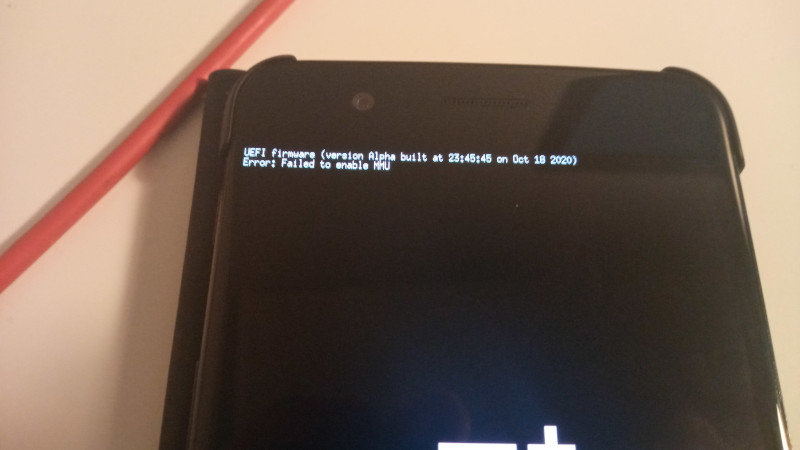

# edk2-oneplus5
Attempt to create a minimal EDK2 for OnePlus 5.

## Status
The phone boots EDK2 & enters crashdump 900E mode after sitting for ~10 seconds on a screen with:
```
Error: Failed to enable MMU
```


### Working
* Continuous Display
* ...

### Not Working
* ...

## Building
Tested on Ubuntu 20.04 & Arch Linux.

First, clone EDK2:
```
cd ..
git clone https://github.com/tianocore/edk2.git --recursive
git clone https://github.com/tianocore/edk2-platforms.git
```

You should have all three directories (`edk2`, `edk2-platforms` & `edk2-oneplus5`) side by side.

Next, install the dependencies:

Ubuntu 20.04:
```
sudo apt install build-essential uuid-dev acpica-tools git nasm python3-pip gcc-aarch64-linux-gnu abootimg p7zip-full bsdiff
sudo pip3 install uefi_firmware
```

Arch Linux:
```
sudo pacman -S --needed base-devel acpica git nasm python aarch64-linux-gnu-gcc p7zip bsdiff
yay -S --needed abootimg-git uefi-firmware-parser-git
```

Then, extract the XBL binary from your device (the powerful `dd` will serve you), name it `xbl.elf` and place it in the current directory.

Now execute `./extract-xbl.sh` to get the proprietary blobs extracted.  
If you just cloned this, also run `./firstrun.sh`.  
Finally, `./build.sh`.

Then `fastboot boot uefi.img`.

# Credits
This is based on fxsheep's [edk2-sagit](https://github.com/UEFI4Phone/edk2-sagit), which is based on zhuowei's [edk2-pixel3](https://github.com/Pixel3Dev/edk2-pixel3).  
SimpleFbDxe screen driver is from imbushuo's [Lumia950XLPkg](https://github.com/WOA-Project/Lumia950XLPkg).  
Special thanks to @lemon1ice, @gus33000 and @imbushuo for guidance.
